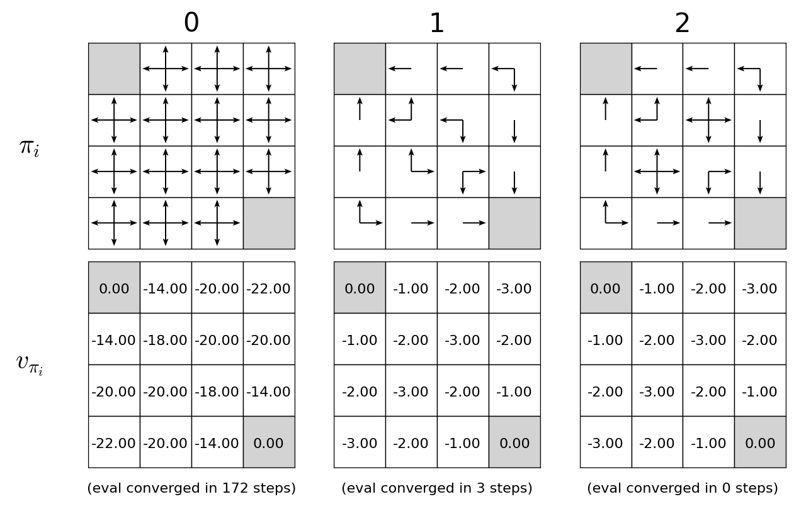
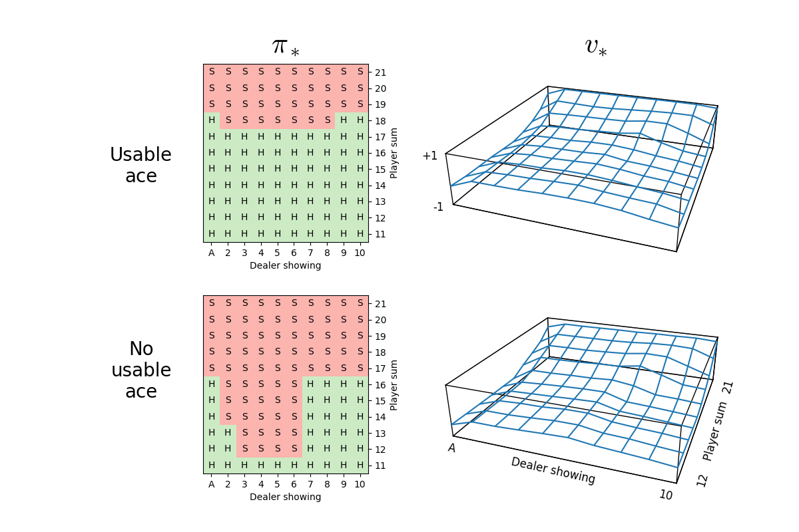
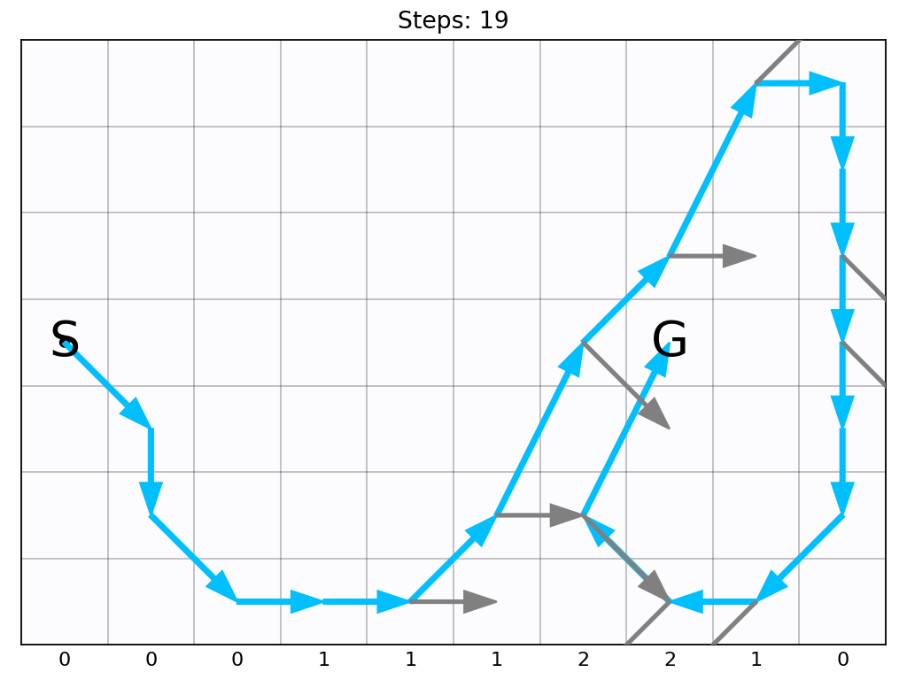

# Reinforcement Learning Exercises

This repository is to document coding exercises through my learning journey on RL.
I will be mainly following Barto and Sutton's 2018 textbook as well as DeepMind x UCL, namely the [2021](https://www.youtube.com/playlist?list=PLqYmG7hTraZDVH599EItlEWsUOsJbAodm) and [2018](https://www.youtube.com/playlist?list=PLqYmG7hTraZCkftCvihsG2eCTH2OyGScc) offerings.

Other useful learning resources include:

- Gonkee's [The FASTEST introduction to Reinforcement Learning on the internet](https://www.youtube.com/watch?v=VnpRp7ZglfA)
- Mutual Information's [Reinforcement Learning By the Book](https://www.youtube.com/playlist?list=PLzvYlJMoZ02Dxtwe-MmH4nOB5jYlMGBjr) series
- Steve Brunton's [Reinforcement Learning](https://www.youtube.com/playlist?list=PLMrJAkhIeNNQe1JXNvaFvURxGY4gE9k74) series

## Roadmap

| Topic                                             | Description       | Programming Exercises         | Status | Results |
| :---                                              |    :----          |                       :---    | ---:   | :---
| Multi-armed Bandits                               | Ch. 2             | Bandits                       | ✅    | [Bandits](./bandits/bandits.md)
| Finite MDP, Dynamic Programming                   | Chs. 3-4          | GridWorld, Jack's Car Rental, Gambler's Problem |✅| [ Figures only](./dp/results) |
| Model Free Learning (Monte Carlo, TD learning)    | Chs. 5-7, 12      | Blackjack, Windy GridWorld, Cliffwalking | 🚧 In progress | [MC for Blackjack](./model_free/modelling_blackjack.md)
| Deep Reinforcement Learning    | ??? | ??? | ⏳ Planned
| Reinforcement Learning on LLMs    | ??? | ??? | ⏳ Planned

## Barto and Sutton (2018) Chapters at a Glance

<table>
  <colgroup>
    <col width="50%">
    <col width="50%">
  </colgroup>

  <tr>
    <th colspan="1">Chapter 2</th>
    <th colspan="1">Chapter 3–4</th>
  </tr>
  <tr>
    <td align="center">
       
      <a href="./bandits/bandits.md">Multi-armed Bandits</a>
    </td>
    <td align="center">
       
      <a href="./dp/results">Policy Iteration</a>
    </td>
  </tr>

  <tr>
    <th colspan="2">Chapter 5</th>
  </tr>
  <tr>
    <td align="center">
       
      <a href="./model_free/blackjack">Monte Carlo Prediction for Blackjack</a>
    </td>
    <td align="center">
       
      <a href="./model_free/blackjack">Monte Carlo Control for Blackjack</a>
    </td>
  </tr>

  <tr>
    <th colspan="2">Chapter 6</th>
  </tr>
  <tr>
    <td align="center">
       
      <a href="./model_free/gridworld/stochastic/100k/gridworld_sarsa_greedy_episode_100000_0.5_2.png">Sarsa for Stochastic Windy Gridworld</a>
    </td>
  </tr>

</table>
