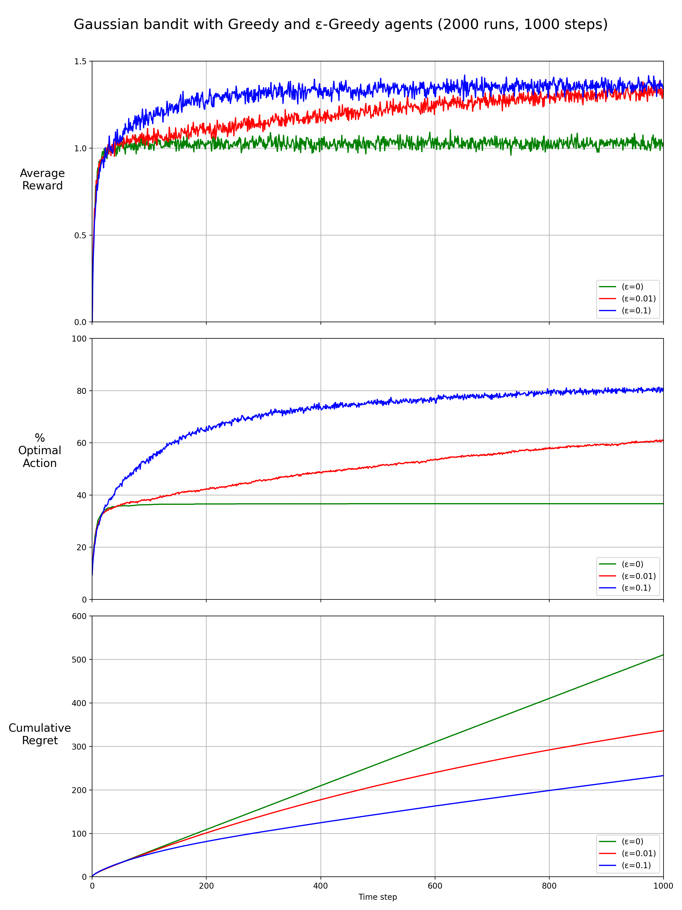
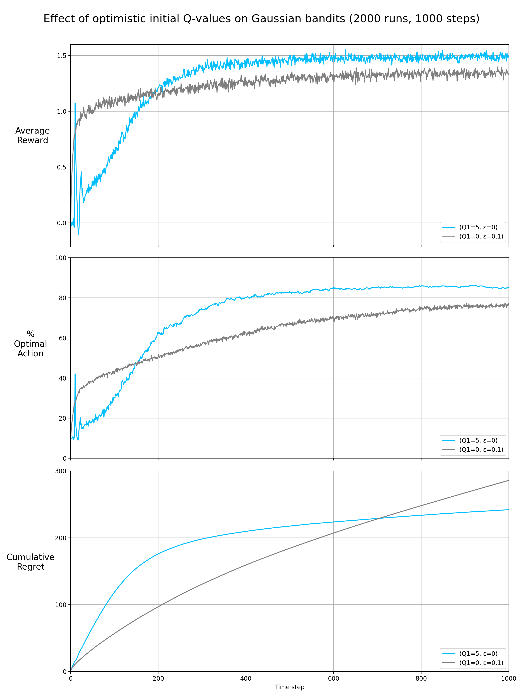
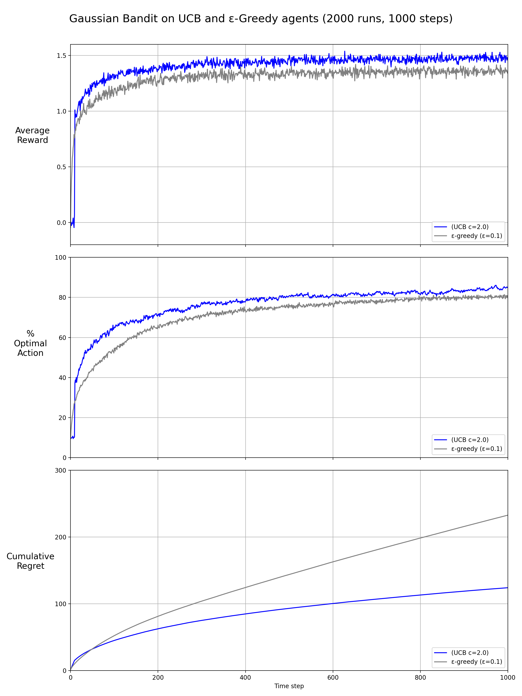
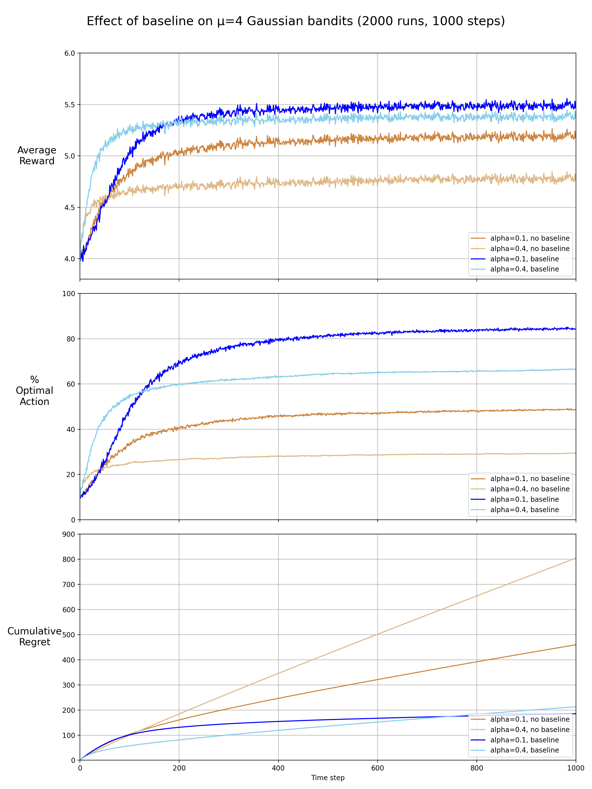
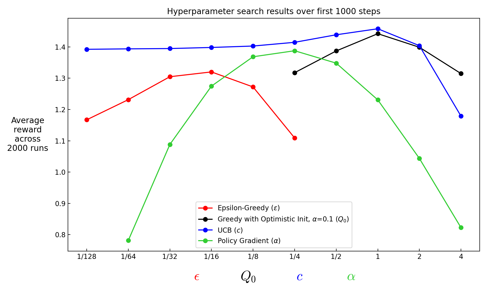
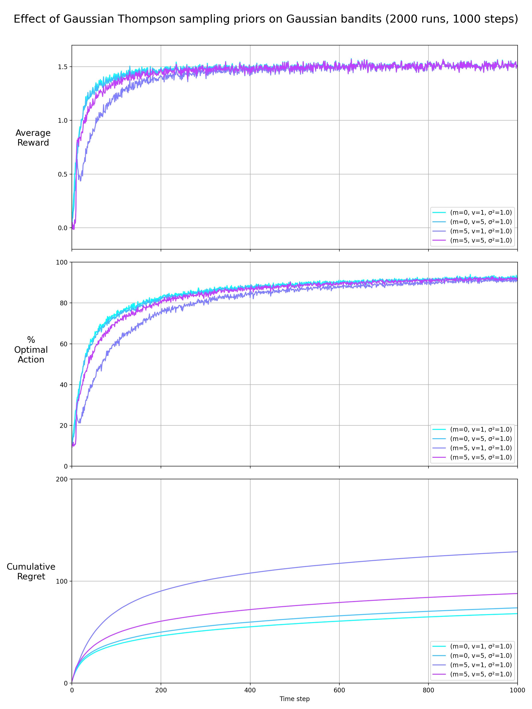
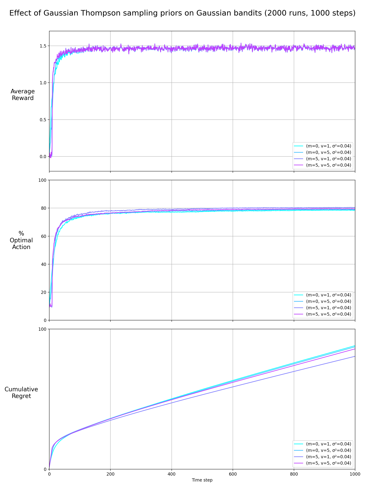
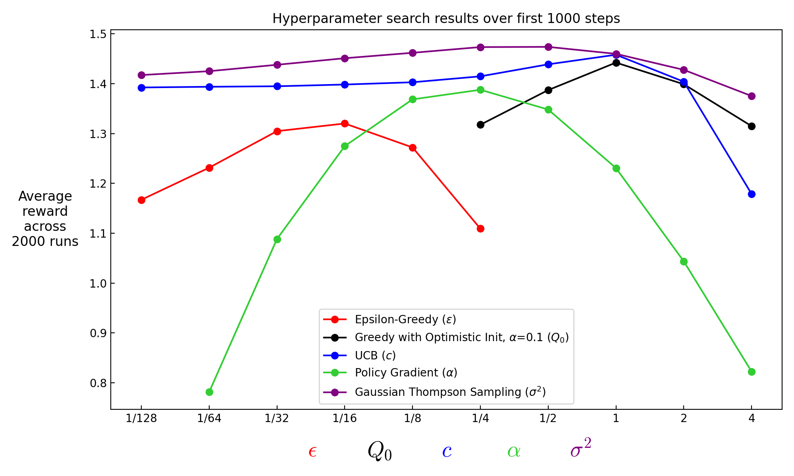

# Results

## Barto and Sutton Figures

<html>
     
    
</html>

**Figure 2.2:** Average performance of epsilon-greedy action-value methods on the 10-armed testbed.
These data are averages over 2000 runs with different bandit problems. All methods used sample
averages as their action-value estimates

<html>
     
    
</html>

**Figure 2.3:** The effect of optimistic initial action-value estimates on the 10-armed testbed.
Both methods used a constant step-size parameter, alpha = 0.1.

<html>
     
    
</html>

**Figure 2.4:** Average performance of UCB action selection on the 10-armed testbed. As shown,
UCB generally performs better than epsilon-greedy action selection, except in the first k steps, when
it selects randomly among the as-yet-untried actions.

<html>
     
    
</html>

**Figure 2.5:** Average performance of the gradient bandit algorithm with and without a reward
baseline on the 10-armed testbed when the q*(a) are chosen to be near +4 rather than near zero.

<html>
     
    
</html>

**Figure 2.6:** A parameter study of the various bandit algorithms presented in this chapter.
Each point is the average reward obtained over 1000 steps with a particular algorithm at a
particular setting of its parameter.

Note: In my version I have included a wider range for some hyperparameters. UCB's was extended to 1/128 to demonstate its stability, policy gradient to illustrate its sensitivity.

## Appendix

### Thompson Sampling

Must have the conjugate prior. Turns out to be better than the other algorithms (Supplemetary Figure C). It is robust to priors of mean/variance of the bandit value (inital guess and uncertainty), but the variance of the reward (how much to trust each observation) affects it greatly -- low variance equates to trusting observations too much i.e. being too greedy in a sense and not finding the optimal action (Supplemetary Figure B).

<html>
    
</html>

**Supplementary Figure A:** Thompson Sampling

<html>
    
</html>

**Supplementary Figure B:** Thompson Sampling with a lower reward variance leads to fast learning to good actions but ultimately too greedy to explore and find the best.

<html>
    
</html>

**Supplementary Figure C:** A parameter study of the various bandit algorithms presented in this chapter, plus Thompson Sampling.\
Each point is the average reward obtained over 1000 steps with a particular algorithm at a particular setting of its parameter.
