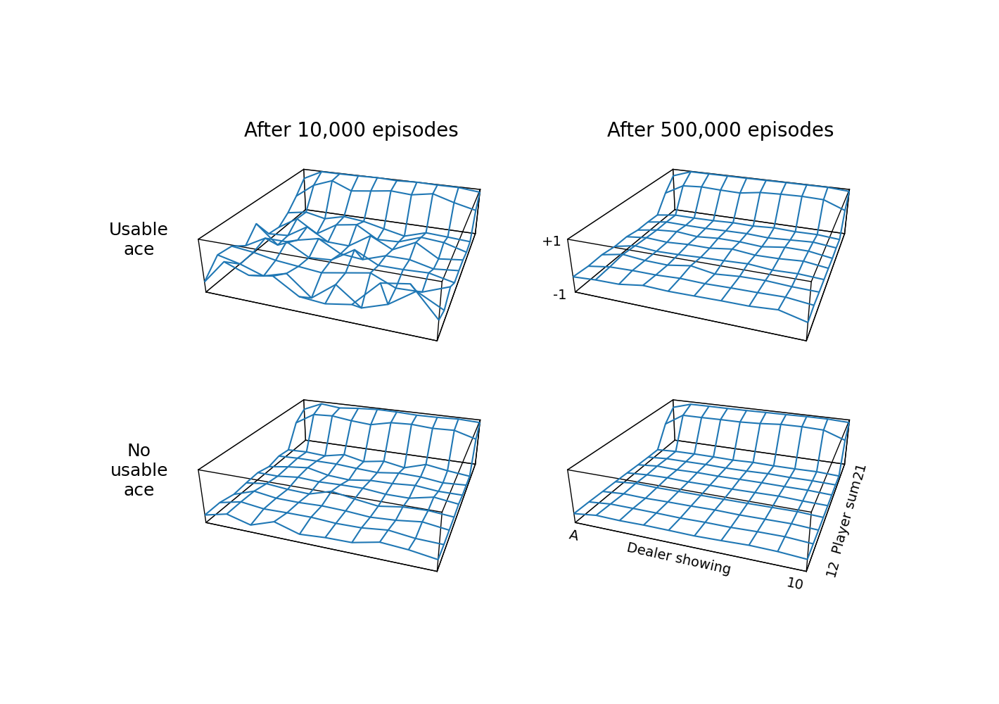
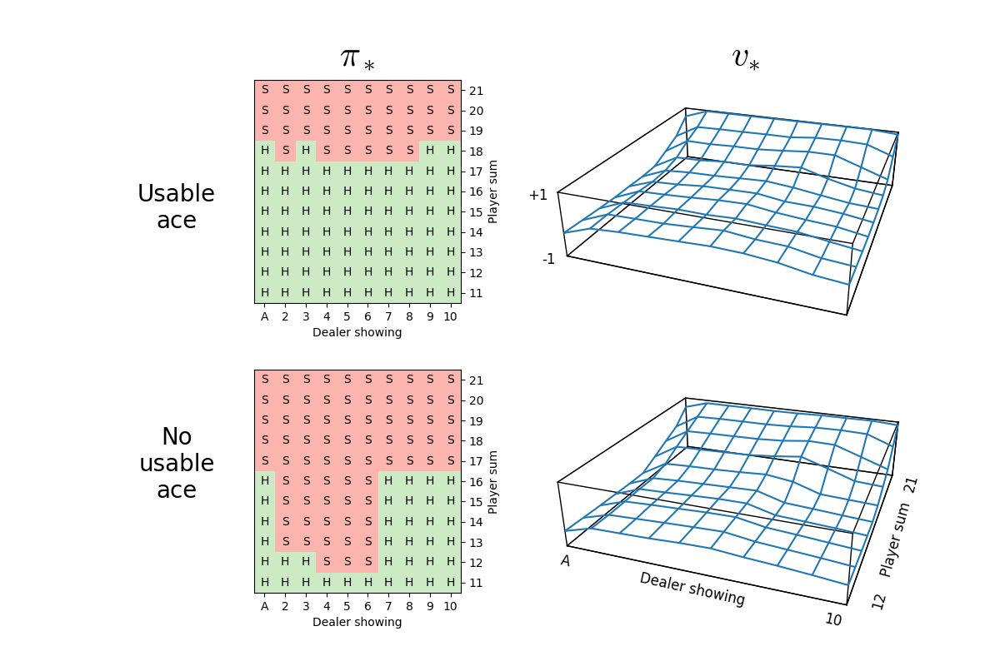
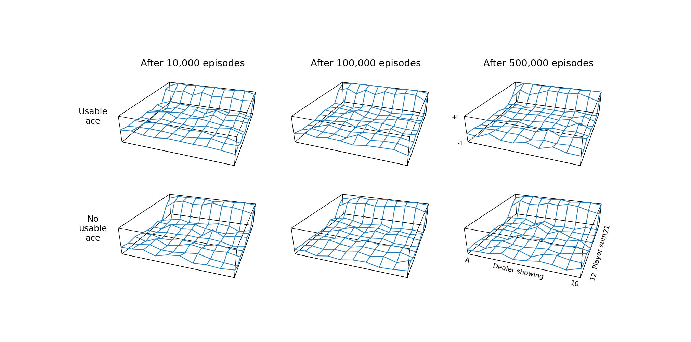
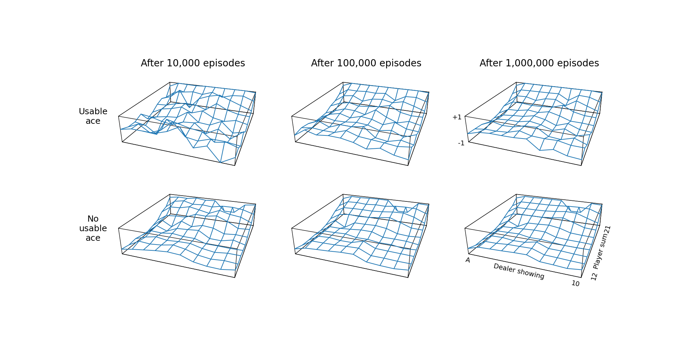

# Results

## Barto and Sutton Figures

<html>
     
    
</html>

**Figure 5.1:** Approximate state-value functions for the blackjack policy that sticks only on 20
or 21, computed by Monte Carlo policy evaluation.

<html>
     
    
</html>

**Figure 5.2:** The optimal policy and state-value function for blackjack, found by Monte Carlo ES.\
The state-value function shown was computed from the action-value function found by
Monte Carlo ES.

Note that the above figure was generated at 5 million simulations. At dealer 3 vs player soft 18, the estimate errantly advises to hit (whereas Barto and Sutton's figure suggests to stand), suggesting that this is a borderline decision that has not had enough simulations to converge to the optimal policy.

## Convergence Speed in Policy Evaluation

SARSA converges to the value of a policy much quicker, demonstrating its sampling efficiency. In Figure A, despite "Usable ace" being a rarer case (causing MC to have a noticeably jagged value surface after 100k episodes), SARSA's estimate is much smoother and closer to V_pi.

<html>
    
    
</html>

**Figure A:** Approximate state-value functions for the blackjack policy that sticks only on 20 or 21.\
Top: computed by Monte Carlo policy evaluation, bottom: computed by SARSA policy evaluation (step size 0.01).

However, the result in Figure B (SARSA with a larger step size) instructively shows that this hyperparameter must be considered with care. Although a larger step size accelerates initial learning (compare the value of player 20/21 at 10k episodes with Figure A), this ultimately prevents it from converging to a smooth value surface. With a constant step size, SARSA updates behave like an exponential recency-weighted average, so a larger value assigns excessive weight to recent returns and increases sensitivity to sampling noise.

<html>
    
</html>

**Figure B:** Approximate state-value functions for the blackjack policy that sticks only on 20 or 21, computed by SARSA policy evaluation (step size 0.10).

## Exploring Starts

Monte Carlo Exploring Starts can be used in conjunction with greedy policy improvement, given that all initial states *and* actions are selected with probability > 0. I understand this intuitively as related to the epsilon-greedy algorithm, where (1-epsilon) of the time you are taking the greedy action. In ES, you leave the epsilon chance that you take the random action to be enacted in your Exploring Starts condition which initiates with a random state-action pair.

Figure C depicts a bug in MC ES where the first action was not randomly sampled, but greedily taken, thus violating the second part of the said condition. Consequently, some state–action pairs are never visited. The result is a mostly-correct value surface, except for some states where the agent takes the non-optimal action (greedily based on its beliefs), and will never explore and discover the optimal action.

<html>
    
</html>

**Figure C:** The optimal policy and state-value function for blackjack, found by a wrong implementation of Monte Carlo ES,\
where the action at the first state is greedy. This prevents the agent from visiting all state-action pairs and finding the optimal policy.

## Appendix

It takes much longer for the policy to converge in the usable ace states, due to them being rarer.

<html>
    
     
    
</html>

**Supplementary Figure A:** General Policy Iteration for blackjack by Monte Carlo ES.
Top: 10k simulations, bottom: 100k simulations.
