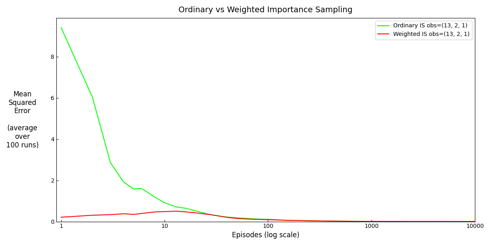
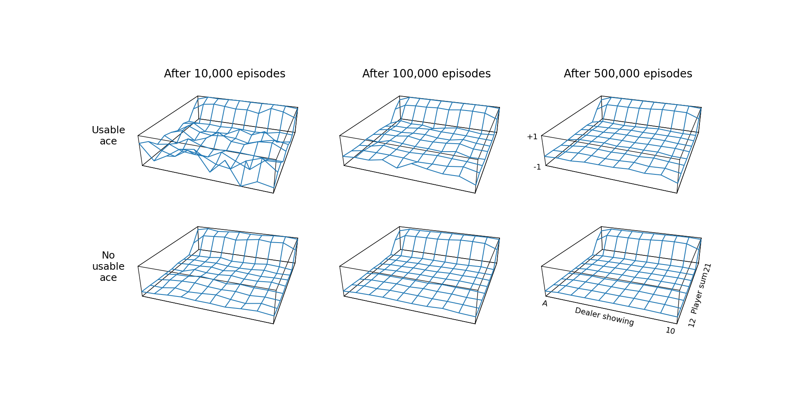
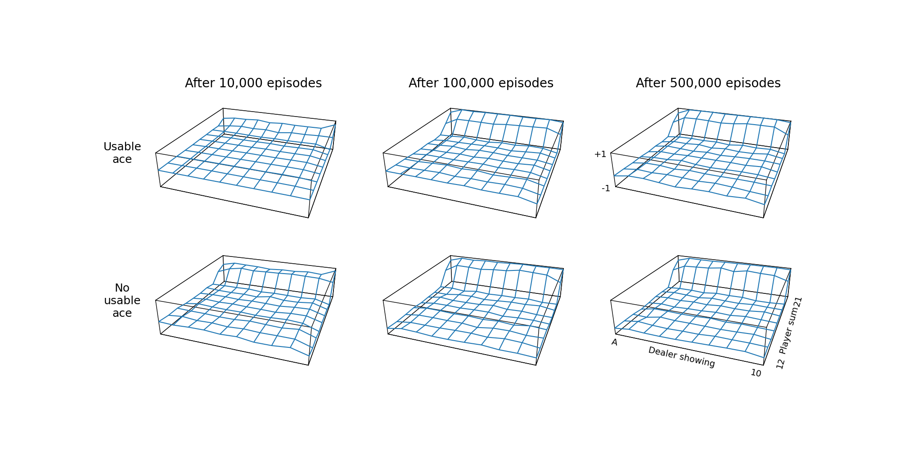
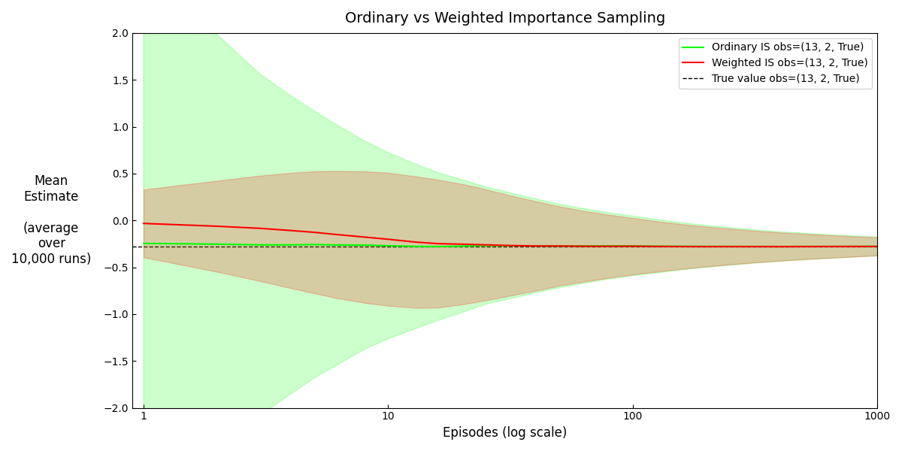
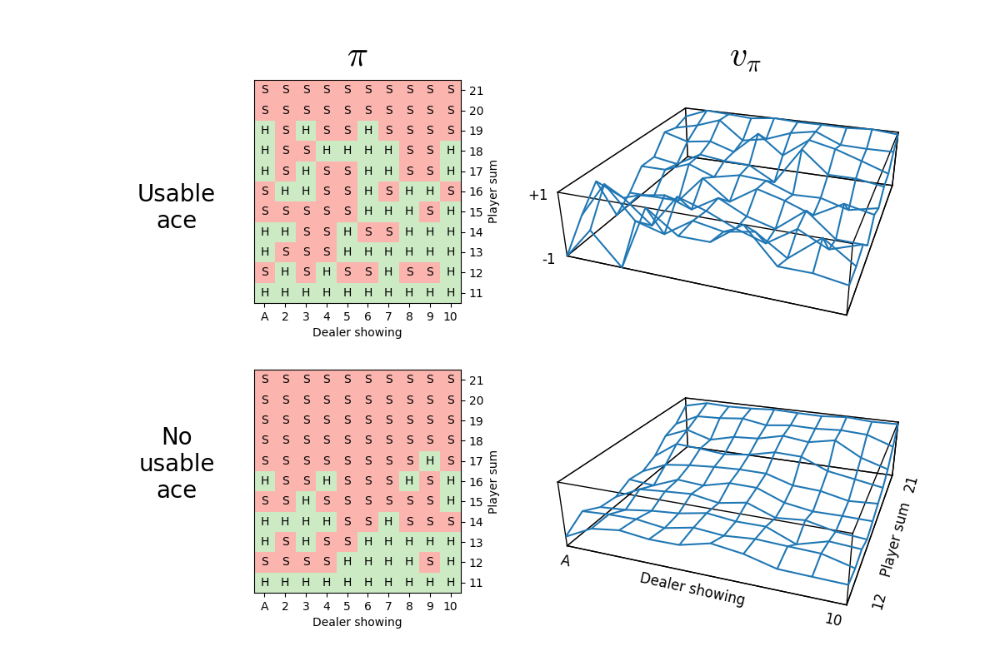
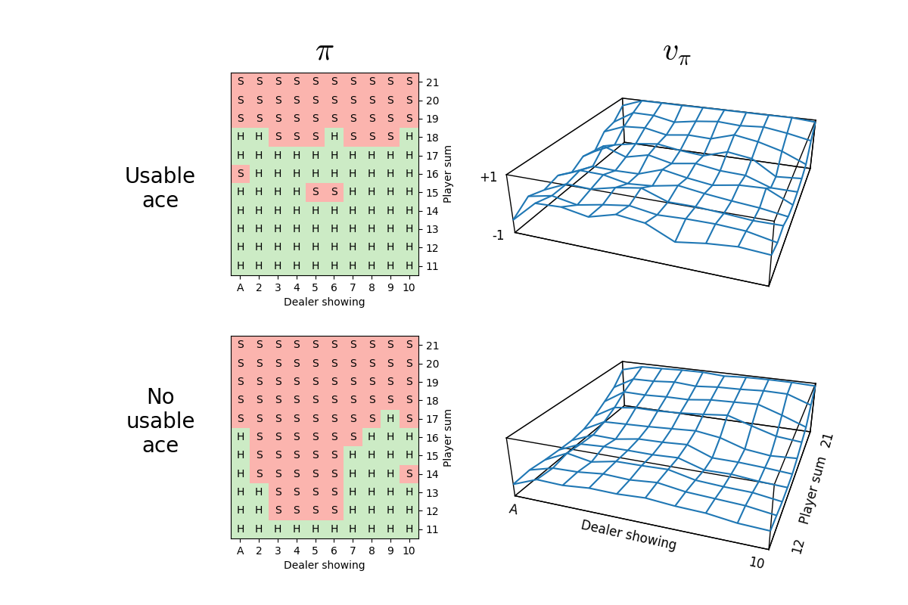
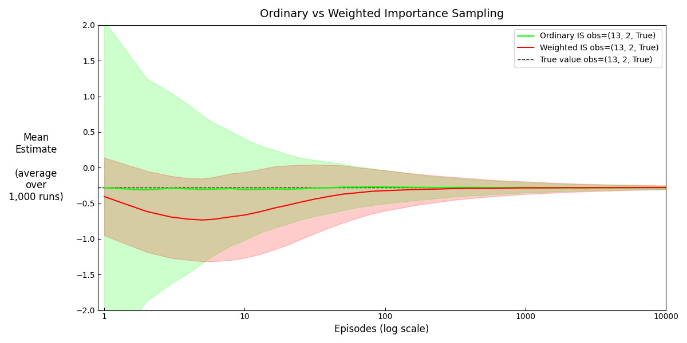
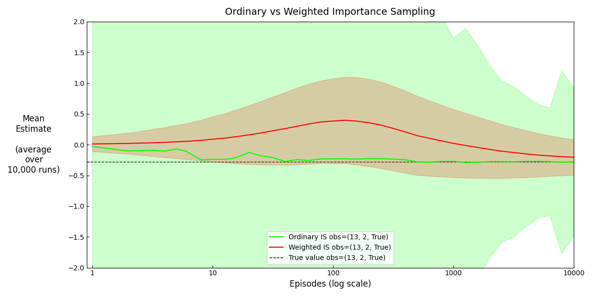

# Results

## Barto and Sutton Figures

<html>
     
    
</html>

**Figure 5.1:** Approximate state-value functions for the blackjack policy that sticks only on 20
or 21, computed by Monte Carlo policy evaluation.

<html>
     
    
</html>

**Figure 5.2:** The optimal policy and state-value function for blackjack, found by Monte Carlo ES.\
The state-value function shown was computed from the action-value function found by
Monte Carlo ES.

Note that the above figure was generated at 5 million simulations. At dealer 3 vs player soft 18, the estimate errantly advises to hit (whereas Barto and Sutton's figure suggests to stand), suggesting that this is a borderline decision that has not had enough simulations to converge to the optimal policy.

<html>
     
    
</html>

**Figure 5.3:** Weighted importance sampling produces lower error estimates of the value of a
single blackjack state from off-policy (50-50 hit/stick) episodes.

## Convergence Speed in Policy Evaluation

SARSA converges to the value of a policy much quicker, demonstrating its sampling efficiency. In Figure A, despite "Usable ace" being a rarer case (causing MC to have a noticeably jagged value surface after 100k episodes), SARSA's estimate is much smoother and closer to V_pi.

<html>
    
    
</html>

**Figure A:** Approximate state-value functions for the blackjack policy that sticks only on 20 or 21.\
Top: computed by Monte Carlo policy evaluation, bottom: computed by SARSA policy evaluation (step size 0.01).

However, the result in Figure B (SARSA with a larger step size) instructively shows that this hyperparameter must be considered with care. Although a larger step size accelerates initial learning (compare the value of player 20/21 at 10k episodes with Figure A), this ultimately prevents it from converging to a smooth value surface. With a constant step size, SARSA updates behave like an exponential recency-weighted average, so a larger value assigns excessive weight to recent returns and increases sensitivity to sampling noise.

<html>
    
</html>

**Figure B:** Approximate state-value functions for the blackjack policy that sticks only on 20 or 21, computed by SARSA policy evaluation (step size 0.10).

## Exploring Starts

Monte Carlo Exploring Starts can be used in conjunction with greedy policy improvement, given that all initial states *and* actions are selected with probability > 0. I understand this intuitively as related to the epsilon-greedy algorithm, where (1-epsilon) of the time you are taking the greedy action. In ES, you leave the epsilon chance that you take the random action to be enacted in your Exploring Starts condition which initiates with a random state-action pair.

Figure C depicts a bug in MC ES where the first action was not randomly sampled, but greedily taken, thus violating the second part of the said condition. Consequently, some state–action pairs are never visited. The result is a mostly-correct value surface, except for some states where the agent takes the non-optimal action (greedily based on its beliefs), and will never explore and discover the optimal action.

<html>
    
</html>

**Figure C:** The optimal policy and state-value function for blackjack, found by a wrong implementation of Monte Carlo ES,\
where the action at the first state is greedy. This prevents the agent from visiting all state-action pairs and finding the optimal policy.

## Off-Policy Importance Sampling

> Off-policy learns about a target policy pi, based on experiences generated by a behavioural policy mu (or b). This is useful for many reasons, for example to learn from observing humans or other agents, to re-use experience from old policies, or to learn about the greedy policy while following the exploratory policy (van Hasselt, "Model-free Control", 2021).

However, this creates a mismatch because trajectories are sampled from mu, but we want to estimate the value of states/state-actions under trajectories acted according to pi. Importance sampling corrects this using a factor rho, defined as the product of the ratios of the action probabilities under the two policies along a trajectory. Returns can be averaged using either *ordinary importance sampling* or *weighted importance sampling*.

Figure D compares ordinary and weighted importance sampling for off-policy MC prediction in blackjack. The ordinary importance sampling is unbiased: in expectation, its estimate equals the true value for any number of episodes. However, this comes at the cost of extremely high variance, indicative of its sensitivity to rare trajectories with large importance weights. In contrast, weighted importance sampling has small variance and some bias that converges to zero after not that many episodes.

The reason why the variance of weighted importance sampling grows from episode 1 to ~10 is that a particular simulation may need many episodes before getting the first one with nonzero-weight. Before such appears, the estimate will stay at zero. Variance grows because initial estimates will vary; in fact, for the first nonzero-weight episode, the ratio cancels out leaving G (which is a sample from mu conditioned on matching pi with nonzero-weight). Over time, more nonzero-weight returns contribute to each estimate, making the weighted average more stable and reducing the variance.

<html>
    
</html>

**Figure 5.3:** Mean and 1 stddev of estimates of the "stick on 20/21" strategy using ordinary and weighted importance sampling of trajectories from player 13 with ace and dealer 2, from off-policy (50-50 hit/stick) episodes.

## Appendix

### Convergence Speed

It takes much longer for the policy to converge in the usable ace states, due to them being rarer.

<html>
    
     
    
</html>

**Supplementary Figure A:** General Policy Iteration for blackjack by Monte Carlo ES.
Top: 10k simulations, bottom: 100k simulations.

### Behaviour-Target Similarity

The similarity of the behaviour policy to target policy affects convergence of weighted IS (Supplementary Figure B). The more mu is different to the greedy target, the fewer nonzero-weight episodes and slower convergence -- because they are rarer, weights are enormous in ordinary IS, explaining the huge variance.

**Why weighted IS drifts downward for the 90% hit policy:**

Target-consistent paths are those that hit with 90% until reaching 20/21, then either stick with 10%, or hit with 90% until bust. The latter is more likely since you don't need the 10% stick. This means *on average*, early weighted estimate are more likely to be losing trajectories than winning ones. Over time, more target-consistent episodes of all kinds are observed (such as a rare hit-to-20/21-stick-and-win trajectory which would have high importance weight), so the estimate eventually converges toward the true value.

**Why weighted IS drifts upward for the 10% hit policy:**

Same logic as above, just vice-versa.

<html>
    
     
    
</html>

**Supplementary Figure B:** Mean and 1 stddev of estimates of the "stick on 20/21" strategy using ordinary and weighted importance sampling of off-policy trajectories from player 13 with ace and dealer 2. Top: 90-10 hit/stick, bottom: 10-90 hit/stick.
